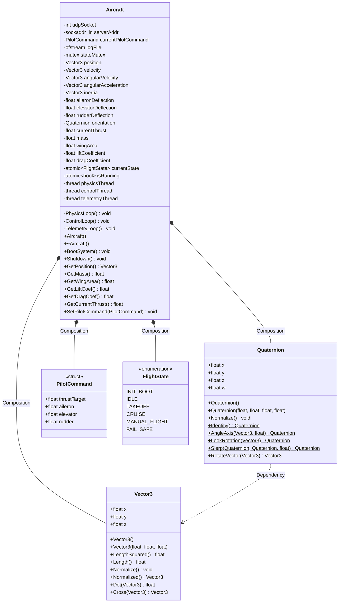
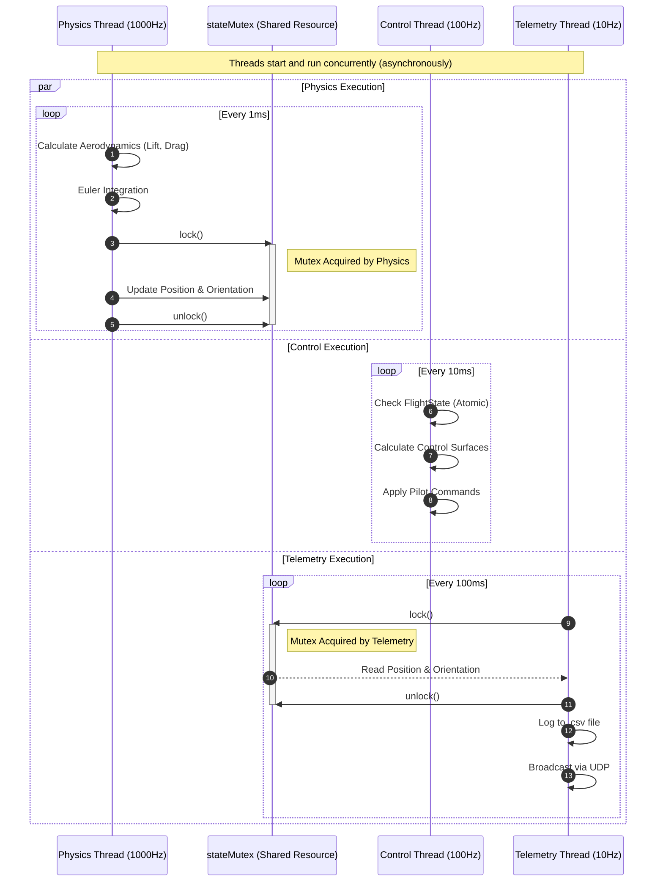

# 🛩️ RTOS-Based 6-DOF Aircraft Flight Simulator


## 🚀 Project Overview
This project is a high-performance, **multithreaded 6-Degrees-of-Freedom (6-DOF) aircraft flight simulator** built entirely from scratch in C++. 

Originally developed as a spin-stabilized sounding rocket simulation, the project has evolved to model complex aircraft aerodynamics and embedded flight software architectures. It demonstrates **Real-Time Operating System (RTOS)** concepts, custom physics engines, advanced 3D mathematics without relying on external libraries like GLM or Eigen, and features real-time 3D web visualization.

## 🧠 Core Engineering Features

### 1. Custom Mathematical Engine
- **`Vector3` & `Quaternion`:** Custom implementations for handling 3D transformations, preventing gimbal lock, and maintaining numerical stability during spatial rotations.

### 2. Multithreaded Execution Architecture
Simulating a real Flight Control Computer (FCC), the software decouples critical tasks into concurrent threads using `std::thread`, `std::mutex`, and `std::atomic`:
- 🔴 **Physics Thread (~1000Hz):** High-priority loop for rigorous Newtonian mechanics, lift/drag calculations, and Euler integration. Non-blocking.
- 🟡 **Control Thread (~100Hz):** Manages the **Flight State Machine** (`INIT_BOOT`, `IDLE`, `TAKEOFF`, `CRUISE`, `MANUAL_FLIGHT`, `FAIL_SAFE`) and control surface actuation (aileron, elevator, rudder).
- 🟢 **Telemetry Thread (~10Hz):** Low-priority loop that securely reads state data via mutexes. It logs data to `.csv` and streams live telemetry over UDP for real-time visualization.

### 3. Aerodynamics & Physics
- Implementation of Lift ($L = \frac{1}{2} \rho v^2 S C_L$) and Aerodynamic Drag.
- Thrust vectoring and 6-DOF movement.
- Thread-safe data structures preventing race conditions during high-frequency integration.

### 4. Real-Time Telemetry & 3D Visualization
- **UDP Data Stream:** The C++ simulator broadcasts live flight state data over a local UDP socket.
- **Python WebSocket Bridge:** A backend Python server (`telemetry_server.py`) receives UDP packets and forwards them to web clients.
- **Three.js Web Dashboard:** An interactive HTML visualizer (`visualizer.html`) that renders the aircraft's orientation and flight dynamics in real-time in the browser.

## 📂 Repository Structure
* `src/` - Core source files (`main.cpp`, `Aircraft.cpp`, etc.).
* `include/` - Header files defining the multithreaded architecture.
* `docs/` - System architecture documentation and LaTeX reports.
* `telemetry_server.py` - WebSocket bridge for live visualization.
* `visualizer.html` - 3D Web interface.
* `plot.py` - Python script for plotting static `.csv` flight logs.
* `data/` - Output directory for telemetry logs.

## ⚡ How to Build and Run

1. **Compile the project (requires a compiler with C++11 or higher support):**
   ```bash
   g++ -std=c++17 src/*.cpp -o flight_sim -pthread
   ```

2. **Execute the simulation:**
   ```bash
   ./flight_sim
   ```

3. **Visualize Telemetry Live (3D Web):**
   Run the WebSocket bridge in a new terminal:
   ```bash
   python telemetry_server.py
   ```
   Then open `visualizer.html` in any modern web browser to see the live 3D orientation.

4. **Plot Static Logs (Post-Flight):**
   Run the plotting script to generate Altitude, Velocity, and Acceleration graphs from the CSV logs:
   ```bash
   python plot.py
   ```

🎯 **Purpose:** This project was developed to explore aerospace dynamics and embedded software engineering patterns, specifically targeting the architectural demands of defense and aerospace systems (e.g., TÜBİTAK).



### Multithreaded Execution Sequence

